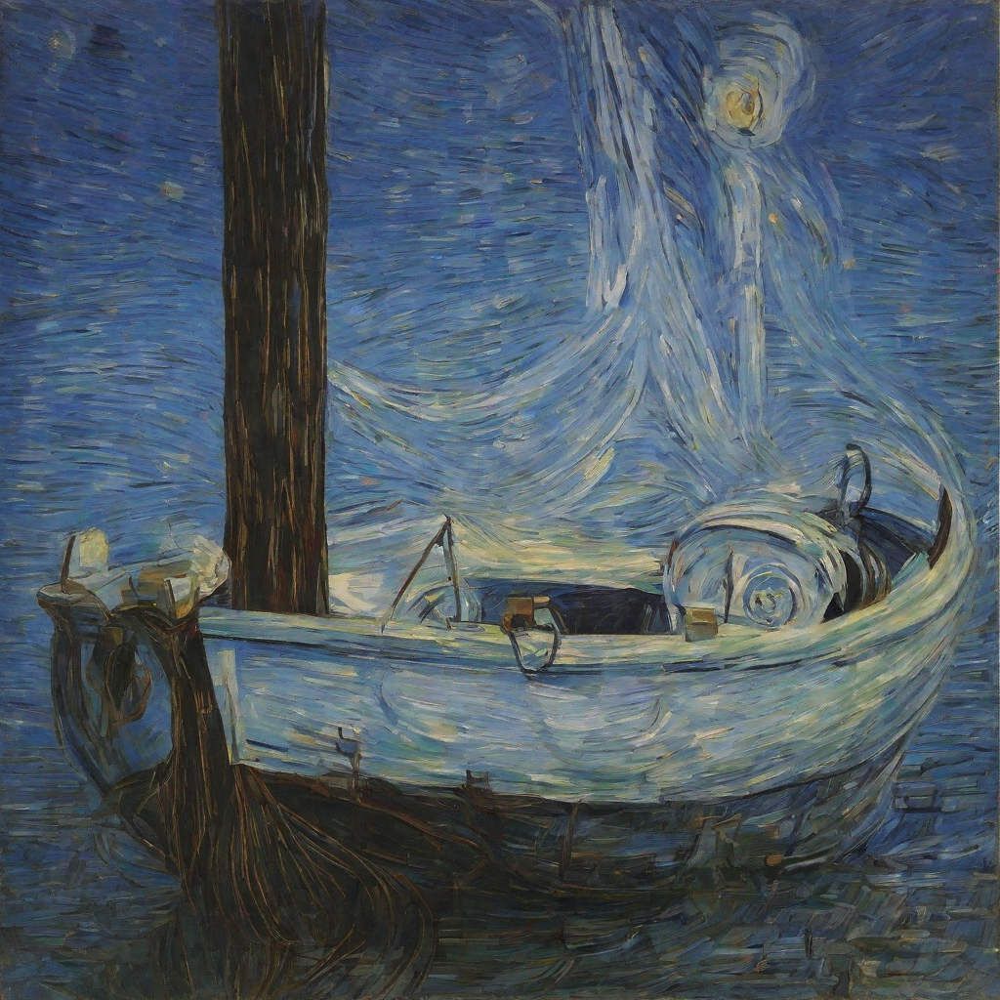
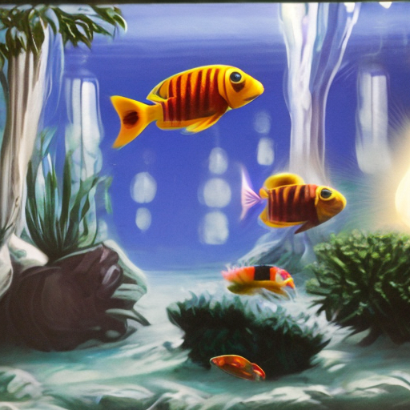
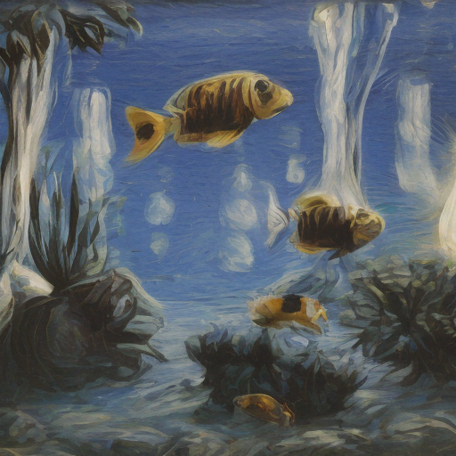
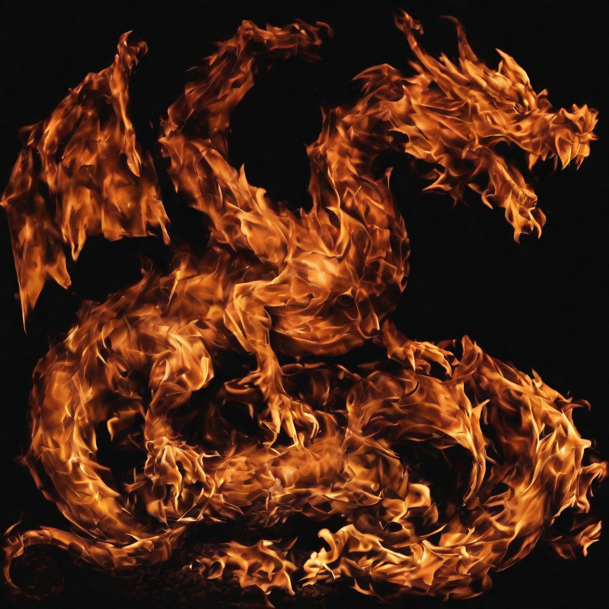
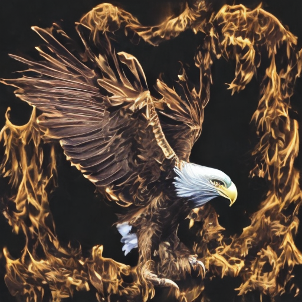
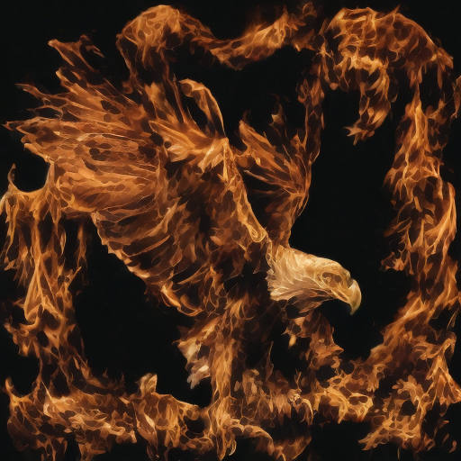

| 第四届计图人工智能挑战赛

# 赛道二：风格迁移图片生成

实例生成结果：





​                  参考风格图片                              DreamBooth + LoRA                                    styletransfer

## 简介

本项目包含了第四届计图人工智能挑战赛 - 风格迁移图片生成的代码实现。本项目对参考的风格图片进行学习，在后续对生成结果进行调整的过程中取得了很好的效果。

## 安装 
| 介绍基本的硬件需求、运行环境、依赖安装方法

本项目可在 1 张 4090 上运行，训练时间约为 6 小时。

#### 运行环境
- ubuntu 20.04 LTS
- python >= 3.8
- jittor >= 1.3.1

#### 安装依赖

#### 0. Clone JDiffusion & Prepare Env

```
git clone https://github.com/JittorRepos/JDiffusion.git
#We recommend using conda to configure the Python environment.
conda create -n jdiffusion python=3.8
conda activate jdiffusion
```

#### 1. Install Requirements

安装JTorch版本的相关深度学习库：

```
pip install git+https://github.com/JittorRepos/jittor
pip install git+https://github.com/JittorRepos/jtorch
pip install git+https://github.com/JittorRepos/diffusers_jittor
pip install git+https://github.com/JittorRepos/transformers_jittor
```

Install JDiffusion

```
cd JDiffusion
pip install -e .
```

#### 2.执行以下命令安装 python 依赖

```
cd ..
pip install -r requirements.txt
```

#### 预训练模型

预训练模型模型下载地址为[stabilityai/stable-diffusion-2-1 at main (huggingface.co)](https://huggingface.co/stabilityai/stable-diffusion-2-1/tree/main)

## 数据预处理
将参考风格数据（A_style）下载解压到 `/styleid/data/sty` 下。

## 训练lora权重
单卡训练可运行以下命令：

```
cd dreambooth
bash train_all.sh
```

## lora微调
生成测试集上DreamBooth + LoRA的结果可以运行以下命令：

```
python run_all.py
```

## 风格迁移

生成测试集上的结果可以运行以下命令：

```
cd styleid
bash train_all.sh
```

## 致谢

此项目基于论文 *A Style-Based Generator Architecture for Generative Adversarial Networks* 实现，部分代码参考了 [jittor-gan](https://github.com/Jittor/gan-jittor)。

此项目基于论文 Style Injection in Diffusion: A Training-free Approach for Adapting Large-scale Diffusion Models for Style Transfer实现。
